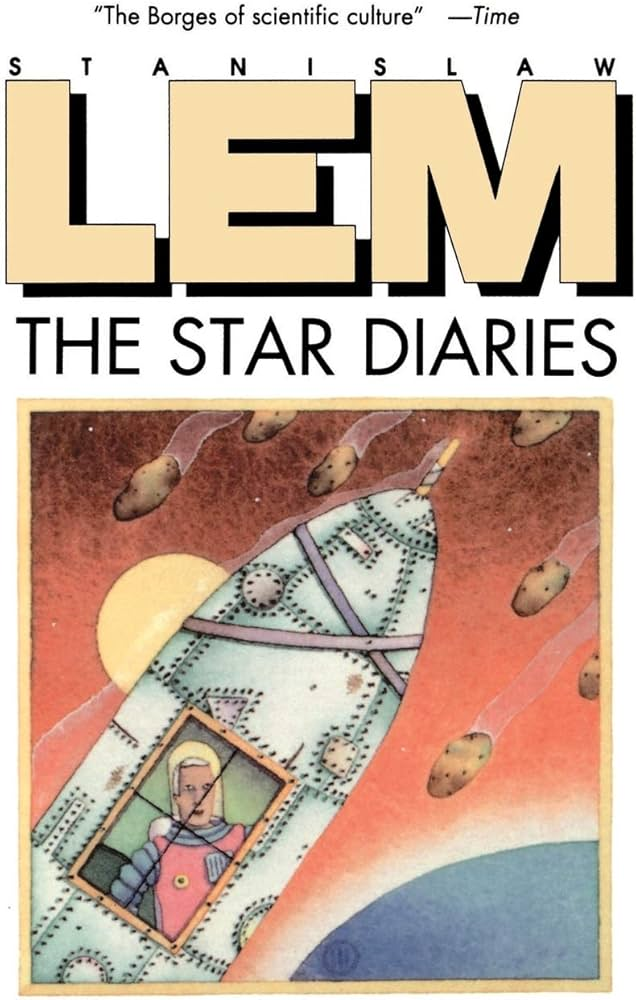

# 🚀 Star Diaries - Demo

  

## 📥 Download
**Ready to play?** You can download the latest version of the demo directly from our [Releases page](https://github.com/byEriK12/Star-Diaries---Chapter-VII/releases).

1. Go to the **Releases** section on the right side of this page.
2. Click on the latest version.
3. Download the `.zip` file under **Assets**.
4. Extract the contents to a folder on your computer and follow the instructions below.

---

## Introduction
Welcome to the demo of **Star Diaries**. In this narrative-driven puzzle game inspired by Stanisław Lem's work, you control Ijon Tichy, a space explorer trapped in a temporal loop where he must cooperate with alternate versions of himself to survive.

---

## How to Play
The gameplay focuses on exploration, dialogue, and technical problem-solving.

### Controls:
* **Movement:** Arrow keys.
* **Interact:** `Enter` to talk to clones or examine objects.
* **Menu/Cancel:** `Esc` or `X`.
* **Minigames (Wiring/Gears):** Use the **Mouse** to perform **Drag & Drop** actions to connect wires or position gears.

---

## Demo Objectives
In this version, you will experience the core pillars of the game:
1. **Exploration:** Navigate the initial zones of the ship to identify system failures.
2. **Dialogue & Persuasion:** Turn your clones into allies. Don't just command them—persuade them!
3. **Technical Maintenance:** Overcome the wiring and gear alignment minigames to restore the ship's systems. 

---

## Execution Instructions
This game was developed using **RPG Maker MZ**. 

### Windows
* **Execution:** Simply double-click the `Game.exe` file. No additional configuration is required.

### macOS
Due to macOS security policies, you may encounter an "Application cannot be opened" error. Please follow these steps to resolve it:

1. **Open Terminal:** Go to `Applications > Utilities > Terminal`.
2. **Remove Quarantine Attributes:** Type `xattr -cr ` (with a space at the end) and drag the `Game.app` folder into the terminal window. Press `Enter`.
3. **Set Permissions Recursively:** To ensure all internal files are accessible, type `chmod -R 755 ` (with a space at the end), drag the `Game.app` folder into the terminal, and press `Enter`.
4. **Launch:** You should now be able to open the application normally.

*Note: If you experience persistent issues or "Segmentation Fault" errors on newer macOS versions, we recommend running the Windows version via an emulator (like Whisky) or on a Windows machine, as older macOS builds of RPG Maker can be incompatible with recent OS updates.*

---

## Development Team
* **Developers:** Martí Girón, Roger Guiñón, Arnau Martin and Eric Matas.
* **Engine:** RPG Maker MZ.

*Thank you for playing our demo! If you encounter any issues, please feel free to report them.*
